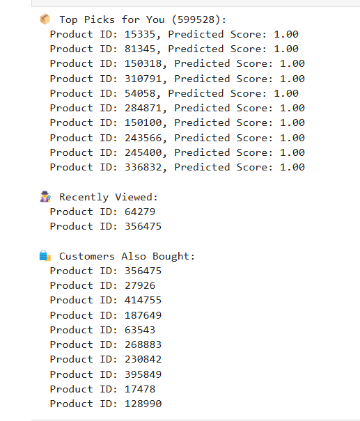

# Product-Recommender
Personalized product recommendation system using Retailrocket eCommerce data and collaborative filtering (SVD). Inspired by Best Buy's real-world personalization use case
# Product Recommender

A personalized product recommendation system inspired by Best Buy's personalization strategy, built using collaborative filtering on real eCommerce interaction data from Retailrocket.

---

## Overview

This project simulates a personalized homepage for an online shopper, showing them tailored product suggestions based on:

- Their **past purchases**
- Products that **similar customers bought**
- **Recently viewed** items

The model is trained on real-world user-event data including views, add-to-carts, and purchases, using a collaborative filtering algorithm (SVD).

---

## Tech Stack

- **Python 3.10**
- **Pandas** for data wrangling
- **Surprise (SVD)** for collaborative filtering
- **Jupyter Lab** for interactive experimentation

---

## Dataset

Retailrocket’s [eCommerce Dataset](https://www.kaggle.com/datasets/retailrocket/ecommerce-dataset)  
(Not included due to file size. Download manually and place `events.csv` in the project folder.)

---

## Features

✅ Collaborative Filtering using Surprise SVD  
✅ Real-user transactions for implicit feedback  
✅ Personalized homepage with:
- 🧠 **Top Picks for You**
- 👀 **Recently Viewed**
- 👥 **Customers Also Bought**

---

## Preview

> Example output from the recommender system:



---

##  How to Run

1. Clone the repository:
   ```bash
   git clone https://github.com/mabdelmalek87/Product-Recommender.git
   cd Product-Recommender
   
Run the following: 

pip install -r requirements.txt
jupyter lab

Open Product_Recommender.ipynb and run all cells.
